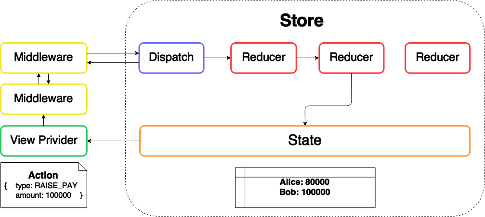

A Tour inside Redux
===
# 

###### Juin Chiu ( [@davidjuin0519](https://github.com/davidjuin0519) )

---
# Asking for a Pay Raise
# 

---
# Redux
# 

---
# What are inside Redux?

#### 1. View Provider
#### 2. Action
#### 3. Middleware
#### 4. Store
#### 5. Dispatch
#### 6. Reducer
#### 7. State

---
# 1. View Provider

- Capable of calling `dispatch` and accessing `state`
- Sometimes need a bridge to attach to Redux

---
# The Bridge: React-Redux
```javascript
// BobsPay.js

class BobsPay extends Component {
 // ...
}

const mapStateToProps = state => 
  ({ pay: state.bob })

const mapDispatchToProps = dispatch => 
  ({
    raisePay: () => dispatch({ type: 'RAISE_PAY', 
                               amount: 100000 })
  })

export default connect(
  mapStateToProps,
  mapDispatchToProps
)(BobsPay)
```
*See more details in [my post](https://medium.com/@juinchiu/how-does-connect-work-in-react-redux-a25c68692335#.cw8qa086p).

---
# 2. Action

- Information of how to renew the **State**
- A plain object
- Must have the key `type`
- Other keys can be anything

```
// action

{
  type: 'RAISE_PAY',
  amount: 100000
}
```
---
# 3. Store

- An enclosure for functions
  - `getState`: returns current **State**
  - `dispatch`: passes an **Action** to **Reducer**
  - `subscribe`: defines a callback after **State** is renewed
  - `replaceReducer`: replaces current **Reducer**
- Customizable with **Reducer** and **Middleware**

---
# 4. State

- A read-only object tree
- The only place to keep the data (Single Source of Truth)
- Can be renewed by **Reducer**
```javascript
// State

{
  pay: {
    alice: 80000,
    bob: 100000,
  },
  willBePromoted: 'chris'
}
```

---
# 5. Dispatch

- A function
- Pass an **Action** to **Reducer**
- Can be passed to **Middleware**

---
# Source Code

```javascript
function dispatch(action) {
  if (isDispatching) {
    throw new Error('Reducers may not dispatch actions.')
  }

  try {
    isDispatching = true
    currentState = currentReducer(currentState, action)
  } finally {
    isDispatching = false
  }

  var listeners = currentListeners = nextListeners
  for (var i = 0; i < listeners.length; i++) {
    var listener = listeners[i]
    listener()
  }

  return action
}
```

---
# 6. Reducer

- Pure Function
- Given **State** and **Action**, returns new **State**
- Can be combined to form a higher-order **Reducer**
- Only the root **Reducer** is passed into **Store**
- The **Reducer** tree maps to the **State** tree

---
# Example
```javascript
// reducer.js

const pay = (state = {}, action) =>
  switch(action.type) {
    case 'RAISE_PAY':
      return Object.assign({}, { bob: action.amount })
    default:
      return state
  }
  
const willBePromoted = (state = '', action) =>
  switch(action.type) {
    case 'BOB':
      return 'bob'
    default:
      return 'chris'
  }
```

---
# `combineReducer`
```javascript
// reducer.js

const rootReducer = combineReducers({ pay, willBePromoted })

// This maps to the structure of state tree
{
  pay: {
    alice: 80000,
    bob: 100000,
  },
  willBePromoted: 'chris'
}
```

---
# 7. Middleware

- Functions that will be called before `dispatch` 
- Function Compose

---
# Functional Programming

  - Describe **what you want** rather than **how you do it**
  - Functions are first-class
  - Higher order functions => map, reduce, filter, compose, curry
  - Lexical closure
  - Referential transparency => pure function
  - Pattern matching
  - Lazy evaluation
  - No side-effects
  - Immutable data

  - Lambda
  - Compose
  - Curry
  - Map / Reduce
  - Lazy evaluation
---